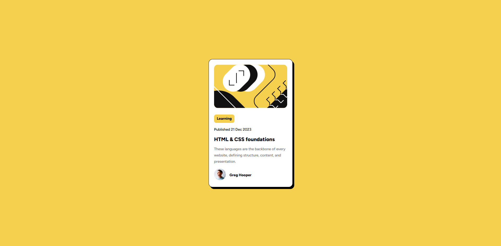

# Frontend Mentor - Solución al componente de vista previa de blog

Esta es mi solución al reto [Blog preview card challenge en Frontend Mentor](https://www.frontendmentor.io/challenges/blog-preview-card-ckPaj01IcS). Los retos de Frontend Mentor me ayudan a mejorar mis habilidades de desarrollo construyendo proyectos reales.

## Tabla de contenidos

- [Descripción general](#descripción-general)
  - [Captura de pantalla](#captura-de-pantalla)
  - [Enlaces](#enlaces)
- [Mi proceso](#mi-proceso)
  - [Construido con](#construido-con)
  - [Lo que he aprendido](#lo-que-he-aprendido)
  - [Recursos útiles](#recursos-útiles)
- [Autor](#autor)

## Descripción general

Este proyecto consiste en una tarjeta de vista previa de un artículo de blog. Está diseñada para practicar conceptos como layout con Grid y Flexbox, tipografía personalizada, diseño mobile-first y estilos visuales como sombras, bordes y colores consistentes. El objetivo es replicar el diseño con fidelidad y aplicar buenas prácticas de HTML y CSS.

### Captura de pantalla

Vista para móviles (375px de ancho):

Vista en escritorio (1440px de ancho):

### Enlaces

- URL de la solución: [https://github.com/ImTommyDev/FrontendMentorProjects/tree/main/blog_preview_card](https://github.com/ImTommyDev/FrontendMentorProjects/tree/main/blog_preview_card)

## Mi proceso

### Construido con

- HTML5 semántico  
- CSS3 (Grid y Flexbox)  
- Flujo de trabajo mobile-first  
- Fuentes personalizadas mediante `@font-face`  
- Variables CSS para mantener una paleta de colores consistente  

### Lo que he aprendido

En este proyecto he podido reforzar conceptos clave como:

- Cómo combinar CSS Grid y Flexbox para crear estructuras visuales limpias.  
- Uso de `@font-face` para importar fuentes personalizadas.  
- Aplicación de `box-shadow` para dar profundidad al diseño.  
- Cómo estilizar un componente utilizando un sistema de diseño basado en variables CSS.  
- Interacciones simples como `hover` para mejorar la experiencia del usuario.  
- Importancia de un diseño mobile-first desde el inicio.  

### Recursos útiles

Estos recursos me ayudaron a lo largo del proceso:

- Herramienta para generar sombras: https://box-shadow.dev/  
- ChatGPT para aclaraciones, dudas conceptuales y estructurar este README (no para escribir el código).  

## Autor

[Tomás Primo Rico](https://www.linkedin.com/in/tomás-primo-rico-801498231)
