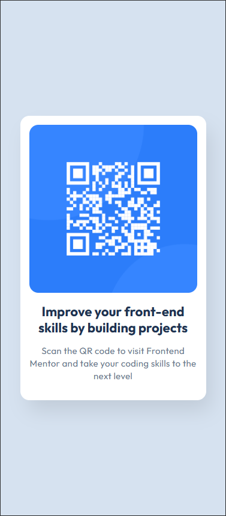

# Frontend Mentor - Solución al componente de código QR

Esta es mi solución al reto [QR code component challenge en Frontend Mentor](https://www.frontendmentor.io/challenges/qr-code-component-iux_sIO_H). Los retos de Frontend Mentor me ayudan a mejorar mis habilidades de desarrollo construyendo proyectos reales.

## Tabla de contenidos

- [Descripción general](#descripción-general)
  - [Captura de pantalla](#captura-de-pantalla)
  - [Enlaces](#enlaces)
- [Mi proceso](#mi-proceso)
  - [Construido con](#construido-con)
  - [Lo que he aprendido](#lo-que-he-aprendido)
  - [Recursos útiles](#recursos-útiles)
- [Autor](#autor)
- [Agradecimientos](#agradecimientos)

## Descripción general

Este proyecto consiste en una tarjeta simple que muestra un código QR, diseñado para practicar el posicionamiento de elementos, el uso de fuentes personalizadas, y aplicar un diseño limpio y centrado, siguiendo el reto propuesto por Frontend Mentor.

### Captura de pantalla

Para teléfono móvil queda de la siguiente manera (375px de ancho):

Y en ordenador de la siguiente (1440px):

### Enlaces

- URL de la solución: [https://github.com/tu-usuario/frontend-mentor-challenges/tree/main/qr-code-component](https://github.com/tu-usuario/frontend-mentor-challenges/tree/main/qr-code-component)
- URL del sitio en vivo: [https://tu-sitio.com/qr-code-component](https://tu-sitio.com/qr-code-component)

## Mi proceso

### Construido con

- HTML5 semántico
- CSS3 (Grid Layout)
- Flujo de trabajo mobile-first
- Fuentes personalizadas usando `@font-face`
- Media queries para mejorar la adaptabilidad

### Lo que he aprendido

En este proyecto he podido practicar y aprender varias técnicas:

- Cómo centrar elementos utilizando CSS Grid con `place-items: center`.
- Uso de la propiedad `aspect-ratio` para mantener las proporciones de las imágenes.
- Cómo importar fuentes personalizadas mediante `@font-face`.
- Aplicación de sombras (`box-shadow`) y bordes redondeados (`border-radius`) para crear un diseño limpio y atractivo.
- Implementación de un flujo de diseño mobile-first desde el inicio.

### Recursos útiles

He utilizado las siguientes webs:

- Para crear bow shadows: https://box-shadow.dev/

- ChatGPT para resolver dudas, para aclaraciones y para estructurar el readme (no para código) 

## Autor

[Tomás Primo Rico](https://www.linkedin.com/in/tomás-primo-rico-801498231)